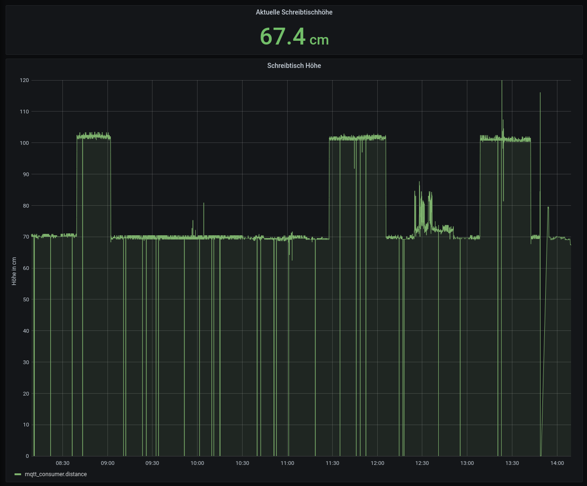

# DesktopHeight
Measure the current height of a standing desk using esp8266 and HS04 ultrasound sensor.

- Code measures height and publishes via mqtt to the broker.
- Values then can be stored and plotted e.g. by influxdb and grafana
- Todo: Craft reminder-app telling you to stand up, if longtime seated
- Todo: evaluate total standing / sitting time.

